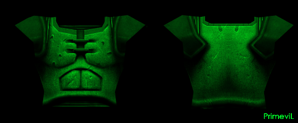
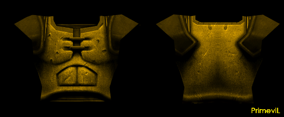
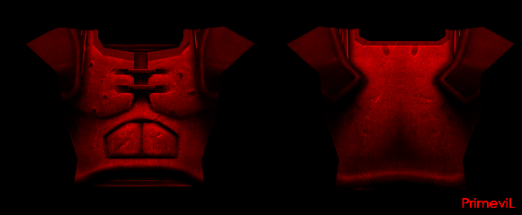
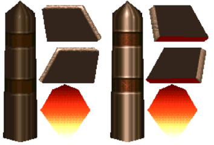
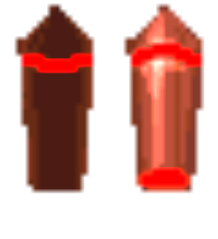

# Streambot ezQuake setup

> https://www.twitch.tv/vikpe

The setup is optmized for **ezQuake 3.6-dev** on a 27" monitor at 2560x1440 resolution.

## How to download

There are several ways to download these files.

* **A)** [**Download as a single .zip
  file** (75 mb)](https://github.com/vikpe/qw-streambot-ezquake/archive/refs/heads/main.zip)
* **B)** Clone the repo: `git clone https://github.com/vikpe/qw-streambot-ezquake.git`
* **C)** Browse and download individual files, e.g. specific [textures](#textures)
  or [the config](https://github.com/vikpe/qw-streambot-ezquake/blob/main/ezquake/configs/streambot.cfg).

## Screenshots


## Textures

### Health packs, mega health, ammo boxes

> Located in: [`/qw/textures/bmodels/`](https://github.com/vikpe/qw-streambot-ezquake/tree/main/qw/textures/bmodels)

 &nbsp;  &nbsp;  &nbsp; 
 &nbsp; 
 &nbsp;
 &nbsp; 
 &nbsp; 
 

* **
Source**: [Colorized QRP models and bmodels](https://gfx.quakeworld.nu/details/372/colorized-qrp-models-and-bmodels/).

* **Changes**:
    * Removed animation on health packs and mega health.
    * Modified HUE / brightness on cells and rockets.

### Armors

> Located in: [`/qw/textures/models/`](https://github.com/vikpe/qw-streambot-ezquake/tree/main/qw/textures/models)

 &nbsp; 
 &nbsp; 


* **Files**: [GA (armor_0.png)](https://github.com/vikpe/qw-streambot-ezquake/blob/main/qw/textures/models/armor_0.png), [YA (armor_1.png)](https://github.com/vikpe/qw-streambot-ezquake/blob/main/qw/textures/models/armor_1.png), [RA (armor_2.png)](https://github.com/vikpe/qw-streambot-ezquake/blob/main/qw/textures/models/armor_2.png)
* **Source**: [Colorized QRP models and bmodels](https://gfx.quakeworld.nu/details/372/colorized-qrp-models-and-bmodels/)
* **Changes**: Modified HUE / brightness for more saturated color.

### Faces

> Located in: [`/qw/textures/wad/`](https://github.com/vikpe/qw-streambot-ezquake/tree/main/qw/textures/wad)

| Name        | Image                                                     | Filename                                             |
|-------------|-----------------------------------------------------------|------------------------------------------------------|
| Face 1      |        | [face_1.png](./qw/textures/wad/face1.png)            |
| Face 2      |        | [face_2.png](./qw/textures/wad/face2.png)            |
| Face 3      |        | [face_3.png](./qw/textures/wad/face3.png)            |
| Face 4      |        | [face_4.png](./qw/textures/wad/face4.png)            |
| Face 5      |        | [face_5.png](./qw/textures/wad/face5.png)            |
| Quad        |    | [face_quad.png](./qw/textures/wad/face_quad.png)     |
| Ring        |   | [face_invis.png](./qw/textures/wad/face_invis.png)   |
| Pent        |  | [face_invul2.png](./qw/textures/wad/face_invul2.png) |
| Pent + Ring |    | [face_inv2.png](./qw/textures/wad/face_inv2.png)     |

### Weapons

> Located in: [`/qw/textures/models/`](https://github.com/vikpe/qw-streambot-ezquake/tree/main/qw/textures/models)


* **Files**: [SSG (g_shot_0.png)](https://github.com/vikpe/qw-streambot-ezquake/blob/main/qw/textures/models/g_shot_0.png), [NG (g_nail_0.png)](https://github.com/vikpe/qw-streambot-ezquake/blob/main/qw/textures/models/g_nail_0.png), [SNG (g_nail2_0.png)](https://github.com/vikpe/qw-streambot-ezquake/blob/main/qw/textures/models/g_nail2_0.png), [GL (g_rock_0.png)](https://github.com/vikpe/qw-streambot-ezquake/blob/main/qw/textures/models/g_rock_0.png), [RL (g_rock2_0.png)](https://github.com/vikpe/qw-streambot-ezquake/blob/main/qw/textures/models/g_rock2_0.png), [LG (g_light_0.png)](https://github.com/vikpe/qw-streambot-ezquake/blob/main/qw/textures/models/g_light_0.png)
* **Source**: Original Quake textures.
* **Changes**: Colorization using ImageMagick (`-colorspace gray -fill yellow -tint 160 -colorize 40`)

### Projectiles

> Located in: [`/qw/textures/models/`](https://github.com/vikpe/qw-streambot-ezquake/tree/main/qw/textures/models)

 &nbsp; 


* **Files**: [missile_0.png](https://github.com/vikpe/qw-streambot-ezquake/blob/main/qw/textures/models/missile_0.png), [grenade_0.png](https://github.com/vikpe/qw-streambot-ezquake/blob/main/qw/textures/models/grenade_0.png)
* **Source**: Original Quake textures.
* **Changes**: Colorization using ImageMagick (`-colorspace gray -fill cyan -tint 160 -colorize 40`)

**lg/shaft beam, nails**

```
gl_custom_lg_color      "200 200 255"   // light blue
gl_custom_spike_color   "255 0 255"     // pink
```

### Map textures

> Located in: [`/qw/textures/`](https://github.com/vikpe/qw-streambot-ezquake/tree/main/qw/textures/)

* **Source**: [Quake Revitalization Project (QRP)](http://qrp.quakeone.com/downloads/)
* **Changes**: JPEG conversion by [Milton](https://www.twitch.tv/Miltonizer) for faster loading time.

### Skins

> Located in: [`/qw/skins/`](https://github.com/vikpe/qw-streambot-ezquake/tree/main/qw/skins/)


* **File**: [2_white.png](./qw/skins/2_white.png)
* **Source**: [PrimeviL 24bit Skins](https://gfx.quakeworld.nu/details/3/primevil-24bit-skins/)

**Skin settings**

Shared baseskin with green color for teammates and red for enemies.

```
baseskin          "2_white"
enemyskin         "2_white"
teamskin          "2_white"
r_skincolormode   "5"
r_enemyskincolor  "255 0 128"
r_teamskincolor   "0 160 0"
```

## Charset

> Located in: [`/qw/textures/charsets/`](https://github.com/vikpe/qw-streambot-ezquake/tree/main/qw/textures/charsets/)

* **File**: [povo5f_xtm.png](https://github.com/vikpe/qw-streambot-ezquake/tree/main/qw/textures/charsets/povo5f_xtm.png)
* **Source**: [povo5f by floder](https://gfx.quakeworld.nu/details/454/povo5f-and-povo5f-cyr/)
* **Changes**: Removed slashes in zeros, modified colored squares.


## How-to

### Convert multiple images at once using ImageMagick

**Example**: Colorize all PNG images in `/source_dir` and save in `/target_dir`.

```sh
convert 'source_dir/*.png' -colorspace gray -fill yellow -tint 160 -colorize 40 -set filename:fn '%[basename]' 'target_dir/%[filename:fn].png
```

## Credits

Thanks to everyone that have provided feedback on the stream (extra thanks to circle, milton, wimpeeh and andeh) and all
authors of content uploaded to [QuakeWorld GFX](https://gfx.quakeworld.nu/).
