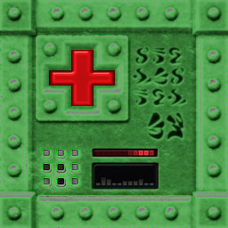
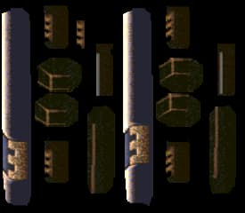

# Streambot ezQuake setup

> https://www.twitch.tv/QuakeWorld

The setup is optimized for **ezQuake 3.6-dev** on a 27" monitor at 2560x1440 resolution.

## How to download

There are several ways to download these files.

* **A)** [**Download as a single .zip
  file** (75 mb)](https://github.com/vikpe/qw-streambot-ezquake/archive/refs/heads/main.zip)
* **B)** Clone the repo: `git clone https://github.com/vikpe/qw-streambot-ezquake.git`
* **C)** Browse and download individual files, e.g. specific [textures](#textures)
  or [the config](https://github.com/vikpe/qw-streambot-ezquake/blob/main/ezquake/configs/streambot.cfg).

## Screenshots


## Textures

### Health packs, mega health, ammo boxes

> Located in: [`/qw/textures/bmodels/`](https://github.com/vikpe/qw-streambot-ezquake/tree/main/qw/textures/bmodels)

 &nbsp;  &nbsp;  &nbsp; 
 &nbsp; 
 &nbsp;
 &nbsp; 
 &nbsp; 
 

* **Source**: [Colorized QRP models and bmodels](https://gfx.quakeworld.nu/details/372/colorized-qrp-models-and-bmodels/).

* **Changes**:
    * Removed animation on health packs and mega health.
    * Modified HUE / brightness on cells and rockets.

### Armors

> Located in: [`/qw/textures/models/`](https://github.com/vikpe/qw-streambot-ezquake/tree/main/qw/textures/models)

 &nbsp; 
 &nbsp; 


* **Files**: [GA (armor_0.png)](https://github.com/vikpe/qw-streambot-ezquake/blob/main/qw/textures/models/armor_0.jpg)
  , [YA (armor_1.jpg)](https://github.com/vikpe/qw-streambot-ezquake/blob/main/qw/textures/models/armor_1.jpg)
  , [RA (armor_2.png)](https://github.com/vikpe/qw-streambot-ezquake/blob/main/qw/textures/models/armor_2.jpg)
* **Source**: [Colorized QRP models and bmodels](https://gfx.quakeworld.nu/details/372/colorized-qrp-models-and-bmodels/)
* **Changes**: Modified HUE / brightness for more saturated color.

### Faces

> Located in: [`/qw/textures/wad/`](https://github.com/vikpe/qw-streambot-ezquake/tree/main/qw/textures/wad)

| Name        | Image                                                     | Filename                                             | Name          | Image                                                 | Filename                                     |
|-------------|-----------------------------------------------------------|------------------------------------------------------|---------------|-------------------------------------------------------|----------------------------------------------|
| Face 1      |        | [face_1.png](./qw/textures/wad/face1.png)            | Face 1 (pain) |  | [face_p1.png](./qw/textures/wad/face_p1.png) |
| Face 2      |        | [face_2.png](./qw/textures/wad/face2.png)            | Face 2 (pain) |  | [face_p2.png](./qw/textures/wad/face_p2.png) |
| Face 3      |        | [face_3.png](./qw/textures/wad/face3.png)            | Face 3 (pain) |  | [face_p3.png](./qw/textures/wad/face_p3.png) |
| Face 4      |        | [face_4.png](./qw/textures/wad/face4.png)            | Face 4 (pain) |  | [face_p4.png](./qw/textures/wad/face_p4.png) |
| Face 5      |        | [face_5.png](./qw/textures/wad/face5.png)            | Face 5 (pain) |  | [face_p5.png](./qw/textures/wad/face_p5.png) |

| Name        | Image                                                     | Filename                                             |
|-------------|-----------------------------------------------------------|------------------------------------------------------|
| Quad        |    | [face_quad.png](./qw/textures/wad/face_quad.png)     |
| Ring        |   | [face_invis.png](./qw/textures/wad/face_invis.png)   |
| Pent        |  | [face_invul2.png](./qw/textures/wad/face_invul2.png) |
| Pent + Ring |    | [face_inv2.png](./qw/textures/wad/face_inv2.png)     |

### Weapons

> Located in: [`/qw/textures/models/`](https://github.com/vikpe/qw-streambot-ezquake/tree/main/qw/textures/models)


**Files**

| Name  | Filename                                            | Image                                                      |
|-------|-----------------------------------------------------|------------------------------------------------------------|
| SSG   | [g_shot_0.png](./qw/textures/models/g_shot_0.jpg)   |   |
| SNG   | [g_nail2_0.jpg](./qw/textures/models/g_nail2_0.jpg) |  |
| GL    | [g_rock_0.jpg](./qw/textures/models/g_rock_0.jpg)   |   |
| RL    | [g_rock2_0.jpg](./qw/textures/models/g_rock2_0.jpg) |  |
| LG    | [g_light_0.jpg](./qw/textures/models/g_light_0.jpg) |  |

* **Source**: Original Quake textures.
* **Changes**: Modified HUE / brightness for saturated color.

### Projectiles

> Located in: [`/qw/textures/models/`](https://github.com/vikpe/qw-streambot-ezquake/tree/main/qw/textures/models)

**missile**

 &nbsp; 

* **File**: [missile_0.png](https://github.com/vikpe/qw-streambot-ezquake/blob/main/qw/textures/models/missile_0.png)
* **Source**: Original Quake textures.
* **Changes**: Increased brightness.

**grenade**

 &nbsp; 

* **File**: [grenade_0.png](https://github.com/vikpe/qw-streambot-ezquake/blob/main/qw/textures/models/grenade_0.png)
* **Source**: Original Quake textures.
* **Changes**: Modified saturation/brightness.

**lg/shaft beam**

```
gl_custom_lg_color       "200 200 255" // light blue
```

### Map textures

> Located in: [`/qw/textures/`](https://github.com/vikpe/qw-streambot-ezquake/tree/main/qw/textures/)

* **Source**: [Quake Revitalization Project (QRP)](http://qrp.quakeone.com/downloads/)
* **Changes**: JPEG conversion by [Milton](https://www.twitch.tv/Miltonizer) for faster loading time.

### Skins

> Located in: [`/qw/skins/`](https://github.com/vikpe/qw-streambot-ezquake/tree/main/qw/skins/)

| Team                                         | Enemy                                         |
|----------------------------------------------|-----------------------------------------------|
|  |  |

* **Source**: [PrimeviL 24bit Skins](https://gfx.quakeworld.nu/details/3/primevil-24bit-skins/)

**Skin settings**

```
teamskin           "team"
enemyskin          "enemy"
r_fullbrightSkins  "0.8"
```

## Crosshair

> Config located under `//Crosshair Settings` in [config](https://github.com/vikpe/qw-streambot-ezquake/blob/main/ezquake/configs/streambot.cfg#L465)

```
crosshaircolor     "255 255 255"
crosshairimage     "xtm01"
crosshairsize      "1.4"
r_smoothcrosshair  "0"
```

> Crosshair image located at [qw/crosshairs/xtm01.png](https://github.com/vikpe/qw-streambot-ezquake/tree/main/qw/crosshairs/xtm01.png)


## Charset

> Located in: [`/qw/textures/charsets/`](https://github.com/vikpe/qw-streambot-ezquake/tree/main/qw/textures/charsets/)

* **File**: [povo5f_xtm.png](https://github.com/vikpe/qw-streambot-ezquake/tree/main/qw/textures/charsets/povo5f_xtm.png)
* **Source**: [povo5f by floder](https://gfx.quakeworld.nu/details/454/povo5f-and-povo5f-cyr/)
* **Changes**: Removed slashes in zeros, modified colored squares.


## How-to

### Convert multiple images at once using ImageMagick

**Example**: Colorize all PNG images in `/source_dir` and save in `/target_dir`.

```sh
convert 'source_dir/*.png' -colorspace gray -fill yellow -tint 160 -colorize 40 -set filename:fn '%[basename]' 'target_dir/%[filename:fn].png
```

## Credits

Thanks to everyone that have provided feedback on the stream (extra thanks to circle, milton, wimpeeh and andeh) and all
authors of content uploaded to [QuakeWorld GFX](https://gfx.quakeworld.nu/).
